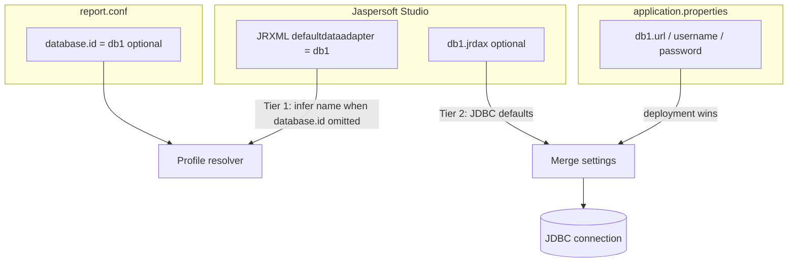

# Database configuration in GenExPlus

GenExPlus connects to **one JDBC database per report job**. Profiles are resolved by name and can be supplied through **Jaspersoft Studio `.jrdax` files**, **`application.properties`**, or both.

This guide explains how Studio, `report.conf`, adapter files, and deployment properties work together.

---

## How profiles are resolved (hybrid model)



### Profile name (who wins?)

| Priority | Source | Example |
|----------|--------|---------|
| 1 | `database.id` in `report.conf` | `database.id=db1` |
| 2 | `defaultdataadapter` in `.jrxml` when `database.id` is omitted | Studio property `db1` |

You **no longer need** `database.id` in `report.conf` when the template already declares `defaultdataadapter=db1`.

### JDBC settings (who wins?)

| Priority | Source | Purpose |
|----------|--------|---------|
| 1 | `db1.*` in `application.properties` | Production credentials (always preferred) |
| 2 | `db1.jrdax` on classpath or disk | Studio export / local defaults |

GenExPlus loads optional **JDBC** `.jrdax` files and merges them with `dbN.*` properties. Deployment properties override adapter file values field-by-field.

### Compiled `.jasper` templates

Tier 1 inference reads `defaultdataadapter` from **JRXML source** only. Compiled `.jasper` files are binary and require explicit `database.id` in `report.conf`.

### Where to put `db1.jrdax`

Searched in order:

1. `net.sf.jasperreports.data.adapter` path in the JRXML (if set)
2. `{name}.jrdax` on the classpath
3. `adapters/{name}.jrdax`
4. `data-adapters/{name}.jrdax`
5. Next to the template file on disk
6. `{report.data.adapter.dir}/{name}.jrdax` from `application.properties`

Only **JDBC** adapters (`jdbcDataAdapter`) are supported. JSON/Excel/HTTP adapters are not loaded by GenExPlus.

---

## The three names (aligned)

| Layer | Example | Role |
|-------|---------|------|
| **Studio adapter name** | `defaultdataadapter=db1` in `.jrxml` | Design-time default; **auto-inferred** at runtime when `database.id` omitted |
| **Report job** | `database.id=db1` in `report.conf` | Explicit override of profile name |
| **Deployment** | `db1.url=…` in `application.properties` | Production JDBC settings (override `.jrdax`) |
| **Adapter file** | `db1.jrdax` | Studio export with driver/URL hints |

**Golden rule:** Use the same name everywhere (`db1`). Ship `db1.jrdax` from Studio for convenience; put secrets in `application.properties` or `REPORT_DB1_*` env vars.

---

## Quick start (PostgreSQL)

### 1. Start a local database (optional)

```bash
./scripts/test-db-up.sh
```

### 2. Configure `application.properties`

```properties
db1.url=jdbc:postgresql://localhost:5432/postgres
db1.username=postgres
db1.password=postgres
db1.driver=org.postgresql.Driver
```

In production, prefer `REPORT_DB1_PASSWORD` instead of a literal password.

### 3. Configure `report.conf` (minimal — Tier 1)

If your `.jrxml` already has `defaultdataadapter=db1`, you can omit `database.id`:

```properties
report.database.optional=false
report.template=/path/to/sales-summary.jrxml
report.output.dir=/var/reports/out
report.output.filename=sales-summary.pdf
report.format=PDF
```

Or set it explicitly:

```properties
database.id=db1
```

### 3b. Optional — export `db1.jrdax` from Studio (Tier 2)

Export the JDBC data adapter from Jaspersoft Studio as `db1.jrdax` and place it on the classpath next to your templates. GenExPlus merges it with `db1.*` from `application.properties` (properties win).

### 4. Run

```bash
./start.sh my-report.conf
# or
java -jar genexplus.jar --config my-report.conf --properties /path/to/application.properties
```

Exit code **3** means JDBC failure (wrong host, credentials, driver missing).

---

## Jaspersoft Studio workflow

1. **Create a JDBC data adapter** in Studio named `db1`.
2. **Set it as default** on the report — Studio writes `defaultdataadapter=db1` into the JRXML.
3. **Design and preview** SQL fields in Studio.
4. **Export the adapter** as `db1.jrdax` (optional but recommended for teams).
5. **Deploy** with `db1.url` / `db1.username` / `REPORT_DB1_PASSWORD` in `application.properties`.
6. **Run** — `database.id` in `report.conf` is optional when step 2 is done.

If Studio preview works but CLI fails, check `db1.*` in `application.properties` — production credentials always come from deployment config, not from Studio's local adapter store.

---

## Multiple databases (`db1`, `db2`, …)

Define as many profiles as needed in **one** `application.properties`:

```properties
# Warehouse (PostgreSQL)
db1.url=jdbc:postgresql://warehouse:5432/analytics
db1.username=report_ro
db1.driver=org.postgresql.Driver

# CRM (MySQL) — mysql-connector-j is bundled in the default build
db2.url=jdbc:mysql://crm:3306/sales
db2.username=report_ro
db2.driver=com.mysql.cj.jdbc.Driver
```

Each **job** picks one profile:

| Job file | Uses |
|----------|------|
| `warehouse-daily.conf` | `database.id=db1` |
| `crm-pipeline.conf` | `database.id=db2` |

Copy-paste examples: [`examples/databases/`](../examples/databases/README.md).

---

## Property reference

### Report job (`report.conf`)

| Key | Default | Description |
|-----|---------|-------------|
| `database.id` | *(empty)* | Profile name; **optional** when JRXML has `defaultdataadapter` |
| `report.database.optional` | `false` | When `true`, DB-less templates need no profile |

**Important:** `report.database.optional=true` means “this job may run without JDBC”. It does **not** ignore a typo in `database.id`. If you set `database.id=db1`, the `db1.*` block must exist.

SQL templates without `database.id` are rejected at validation (exit **1**).

### Deployment (`application.properties`)

Pattern: `db<N>.<property>` where `<N>` is `1`, `2`, `3`, …

| Key | Required | Description |
|-----|----------|-------------|
| `db1.url` | Yes | JDBC URL |
| `db1.username` | Usually | Database user (`db1.user` accepted as alias) |
| `db1.password` | Usually | Prefer `REPORT_DB1_PASSWORD` env var |
| `db1.driver` | No | Defaults to `org.postgresql.Driver` |

Custom names like `database.id=warehouse` with `warehouse.url=…` are **not** supported — keys must match `db\d+`.

### Warnings

| Key | Default | Description |
|-----|---------|-------------|
| `report.database.warnOnAdapterMismatch` | `true` | Warn when JRXML `defaultdataadapter` ≠ explicit `database.id` |
| `report.data.adapter.dir` | *(empty)* | Directory to search for `{name}.jrdax` files |

---

## Environment variable overrides

| Property | Environment variable |
|----------|----------------------|
| `db1.url` | `REPORT_DB1_URL` |
| `db1.username` | `REPORT_DB1_USERNAME` |
| `db1.password` | `REPORT_DB1_PASSWORD` |
| `db2.url` | `REPORT_DB2_URL` |

See [CONFIGURATION.md](CONFIGURATION.md) for the full merge order.

---

## Troubleshooting

| Symptom | Likely cause | Fix |
|---------|--------------|-----|
| Exit **1** — database not configured | `database.id=db1` but no `db1.url` | Add `db1.*` block or fix typo; stderr lists configured profiles |
| Exit **1** — SQL but no database | SQL template with no `database.id` and no `defaultdataadapter` | Set `database.id=db1`, add `defaultdataadapter` in JRXML, or use a DB-less template |
| Exit **3** — database error | Network, credentials, driver | Check URL, user, password; verify driver on classpath |
| Studio works, CLI empty/wrong | Studio adapter ≠ `database.id` | Align names; CLI uses `database.id` only |
| `db1.user` ignored | Wrong property name | Use `db1.username` (or `db1.user` alias in recent versions) |
| Wrong JDBC driver | Missing `dbN.driver` | Set driver explicitly for non-PostgreSQL DBs |

---

## Testing with Docker

```bash
./scripts/test-db-up.sh

# Postgres listens on localhost:5433 by default (avoids clashing with an existing :5432 server)
export REPORT_DB1_URL=jdbc:postgresql://localhost:5433/postgres
export REPORT_DB1_USERNAME=postgres
export REPORT_DB1_PASSWORD=postgres

export REPORT_DB2_URL=jdbc:mysql://localhost:3306/genexplus_test
export REPORT_DB2_USERNAME=genexplus
export REPORT_DB2_PASSWORD=genexplus

mvn -Pe2e test -Dgroups=e2e-db
./scripts/test-db-down.sh
```

E2E scenarios: `12`–`18` (Postgres, MySQL, validation, inferred profile, `.jrdax` merge).

---

## Related docs

- [HOWTO.md § Connect a database](HOWTO.md#2-connect-a-database)
- [CONFIGURATION.md](CONFIGURATION.md)
- [FAQ.md § Databases](FAQ.md#databases--jasperreports-studio)
- [E2E scenarios](../src/test/resources/e2e/README.md)
